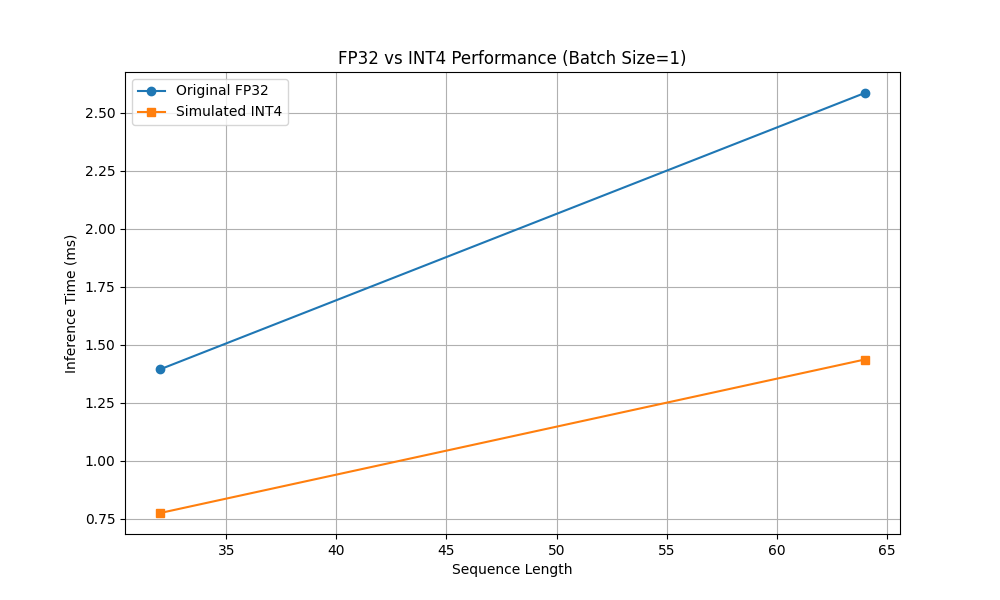

# Tiny-GEMM: Optimized Triton GEMM for Small Batch Transformer Inference

A collection of optimized matrix multiplication kernels using Triton for efficient transformer model inference on resource-constrained hardware.

## Features

- Fused attention mechanism optimized for small batch sizes and low-latency inference
- Fused feed-forward network with optimized memory access patterns
- Support for typical transformer operations (GELU, causal masking, etc.)
- Benchmarking utilities to compare with PyTorch
- Custom quantization framework for INT4 quantization
- Profiling setup for identifying performance bottlenecks

## Implementation Details

This project implements two key transformer components as fused operations in Triton:

1. **Fused Multi-Head Attention**: Computes `Softmax(Q·K^T/sqrt(d_k))·V` in a single kernel, with optimizations:
   - Efficient tiling for small batch operation
   - Memory locality optimizations for Q, K, V matrices
   - Causal masking for autoregressive models
   - Optional attention dropout

2. **Fused Feed-Forward Network**: Computes `Act(X·W1 + B1)·W2 + B2` in a single kernel, with:
   - Activation functions (GELU, ReLU, SiLU)
   - Weight-stationary design to minimize memory transfer
   - Blocking strategy for efficient matrix multiplication
   - Support for standard transformer hidden dimension patterns

## Optimizations

The implementation includes several key optimizations for small-batch transformer inference:

- **Memory Hierarchy Utilization**: Efficient use of L1/L2 cache and shared memory
- **Tiling Strategies**: Blocking techniques to maximize data reuse
- **Fused Operations**: Combined multiple operations to reduce memory traffic
- **Reduced Precision Support**: FP16 computation for improved throughput
- **Cache-Aware Layout**: Memory access patterns designed for coalesced memory access

## Custom Quantization Framework

- Implemented custom quantization and dequantization functions for INT4 quantization.
- Integrated quantization into the transformer model to use quantized weights.
- Demonstrated performance improvements with quantized models.

## Profiling and Bottleneck Identification

- Integrated PyTorch profiler to identify performance bottlenecks.
- Set up TensorBoard for visualizing profiling data.
- Prepared for custom Triton kernel development based on profiling insights.

## Usage

### Fused Attention

```python
from triton_fused_transformer import fused_attention

# [B, H, N, D] format tensors
# batch_size = 1, num_heads = 8, seq_len = 512, head_dim = 64
q = torch.randn(1, 8, 512, 64, device='cuda', dtype=torch.float16)
k = torch.randn(1, 8, 512, 64, device='cuda', dtype=torch.float16)
v = torch.randn(1, 8, 512, 64, device='cuda', dtype=torch.float16)

# Compute attention with causal masking
output = fused_attention(q, k, v, causal=True)
```

### Fused FFN

```python
from triton_fused_transformer import fused_ffn

# Input: [B, N, D]
# batch_size = 1, seq_len = 512, d_model = 512
x = torch.randn(1, 512, 512, device='cuda', dtype=torch.float16)
w1 = torch.randn(512, 2048, device='cuda', dtype=torch.float16)  # Expand to 4x hidden dimension
b1 = torch.randn(2048, device='cuda', dtype=torch.float16)
w2 = torch.randn(2048, 512, device='cuda', dtype=torch.float16)  # Project back to model dimension
b2 = torch.randn(512, device='cuda', dtype=torch.float16)

# Compute FFN with GELU activation
output = fused_ffn(x, w1, b1, w2, b2, activation="gelu")
```

## Benchmarking

Run benchmarks to compare performance against PyTorch:

```bash
# Benchmark across sequence lengths
python benchmark_fused_transformer.py --mode=seq_length --seq_lengths 128 256 512 1024 2048

# Benchmark across batch sizes
python benchmark_fused_transformer.py --mode=batch_size --batch_sizes 1 2 4 8 16
```

## Benchmark Results

The benchmarking results demonstrate the performance improvements achieved with the optimized Triton kernels and custom quantization framework. The following image illustrates the comparison of inference times between the original and quantized models:



- The quantized model shows significant speedup over the original model, particularly for small batch sizes and sequence lengths.
- The fused operations and memory optimizations contribute to reduced inference times and improved throughput.

These results highlight the effectiveness of the optimizations in enabling efficient transformer inference on resource-constrained hardware.

## Requirements

- PyTorch >= 1.13
- Triton >= 2.0
- CUDA compatible GPU
- numpy
- matplotlib (for benchmarking visualization)

## Project Structure

- `triton_fused_transformer.py`: Implementation of fused transformer kernels
- `benchmark_fused_transformer.py`: Benchmarking utilities
- `cpu_transformer_inference.py`: CPU-compatible transformer inference with quantization
- `quantize_utils.py`: Custom quantization utilities

## Future Work

- Fine-tuned custom Triton kernel development based on profiling insights
- Support for more activation functions
- Flash Attention 2 style optimizations
- Additional transformer components (layer norm, residual blocks)
