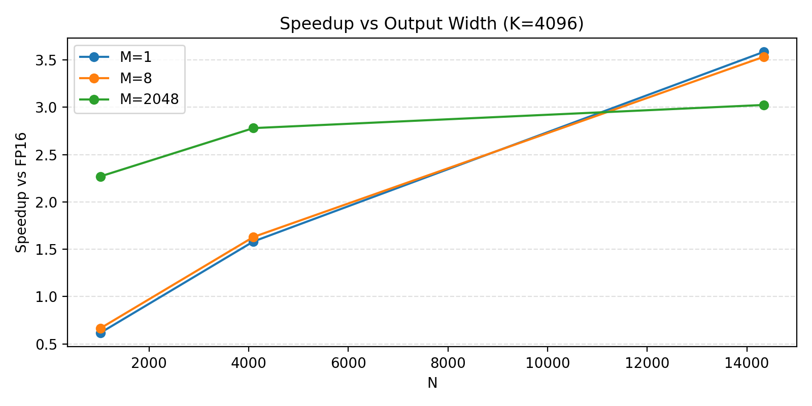
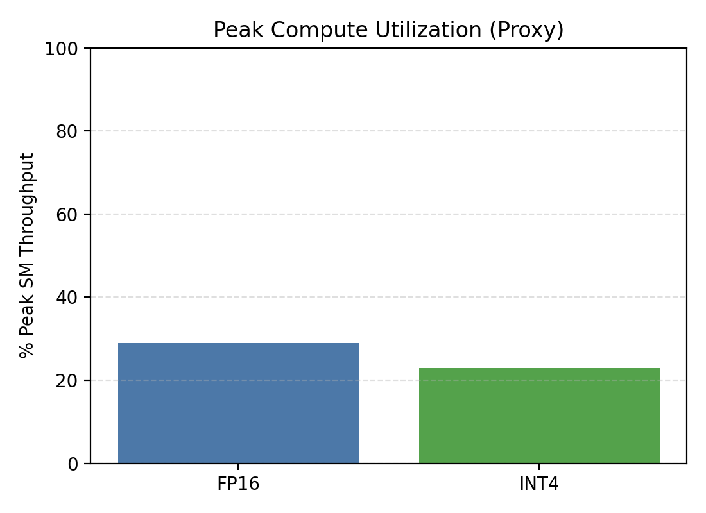
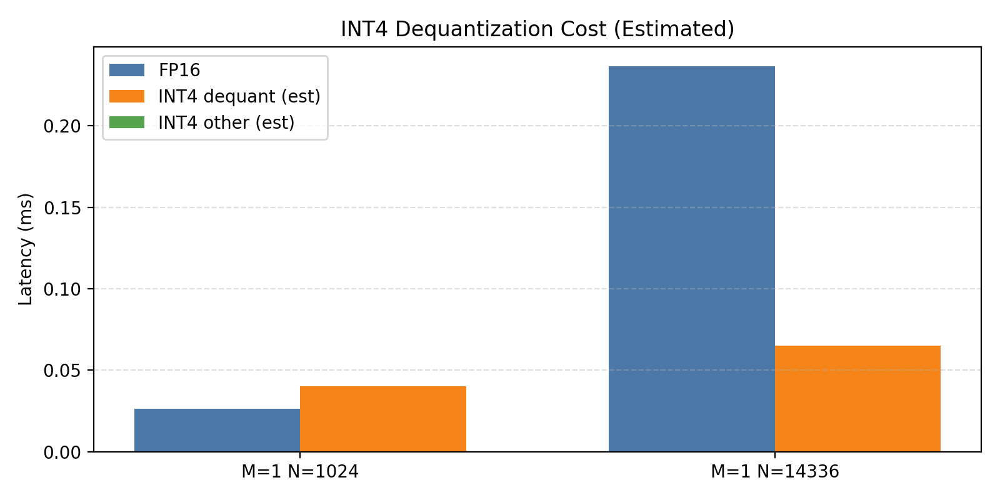

# Tiny-GEMM: INT4 Triton GEMM for Decode-Heavy LLM Inference

Tiny-GEMM is a research-style exploration of packed INT4 GEMM kernels targeting
the decode phase of LLM inference (small batch, skinny matrices). The goal is
not peak FLOPs, but **latency-critical utilization** on cost-effective GPUs
where launch overhead and memory traffic dominate.

## Summary

**Problem:** Decode GEMMs are small, bandwidth-bound, and poorly utilize GPU
hardware. Naive quantization can be slower if dequant overhead dominates.

**Approach:** Implement a packed INT4 GEMM in Triton with static configs for
decode-heavy shapes, then analyze performance using counters and microbenchmarks
to separate **quantization gains** from **kernel effects**.

**Key Findings:**
- INT4 helps for wide FFN decode shapes (large N) where memory traffic dominates.
- INT4 can be slower for narrow projections (e.g., KV) when dequant overhead is
  not amortized.
- Hardware counters confirm the bottleneck shift across regimes.

## Figures

**(A) Speedup vs N**  
Shows when INT4 wins as output width grows.



**(B) % Peak Compute (proxy)**  
SM throughput as a proxy for peak compute utilization (FP16 vs INT4).



**(C) Dequant Breakdown**  
Quantization overhead dominates narrow shapes; amortized for wide FFN.



## Evaluation Setup

- GPU: NVIDIA A10G
- Baselines:
  - FP16 `torch.matmul`
  - Dequantized FP16 (quantize → dequant → FP16 matmul)
  - INT4 packed Triton kernel
- Decode shapes focus: `M ∈ {1,2,4,8}`, `K/N` from Llama-style hidden sizes.

Note: Nsight profiling replays kernels and **inflates wall-clock timings**. Use
profilers for counters/traces, and `benchmark_gemm.py` for latency numbers.

## Reproduce Key Plots

```bash
# Decode benchmark sweep (FP16 + dequant + INT4)
PYTHONPATH=. .venv/bin/python benchmark_gemm.py \
  --shape_list "1,4096,4096;1,4096,1024;1,4096,14336;1,14336,4096;8,4096,4096;8,4096,1024;8,4096,14336;8,14336,4096" \
  --csv results_a10g_decode.csv

# Plot A: Speedup vs N (and other decode figures)
.venv/bin/python tools/plot_decode_report.py \
  --csv results_a10g_decode.csv --out_dir figures

# Dequant breakdown (Plot C)
PYTHONPATH=. .venv/bin/python tools/profile_dequant_breakdown.py \
  --shape_list "1,4096,1024;1,4096,14336" --csv dequant_breakdown.csv
.venv/bin/python tools/plot_dequant_breakdown.py \
  --csv dequant_breakdown.csv --out figures/dequant_breakdown.png

# Nsight Compute counters for peak compute (Plot B)
sudo /opt/nvidia/nsight-compute/2025.4.1/ncu \
  --metrics sm__throughput.avg.pct_of_peak_sustained_elapsed \
  --csv --log-file ncu_fp16_metrics.csv \
  .venv/bin/python tools/profile_fp16_matmul.py --m 1 --k 4096 --n 14336

sudo /opt/nvidia/nsight-compute/2025.4.1/ncu \
  --kernel-name kernel_gemm_packed_int4_static \
  --metrics sm__throughput.avg.pct_of_peak_sustained_elapsed \
  --csv --log-file ncu_int4_metrics.csv \
  .venv/bin/python benchmark_gemm.py --shape_list "1,4096,14336" --rep 3 --warmup 2 --skip_correctness

.venv/bin/python tools/plot_peak_compute.py \
  --fp16_csv ncu_fp16_metrics.csv --int4_csv ncu_int4_metrics.csv \
  --out figures/peak_compute_utilization.png
```

## Repository Structure

- `triton_gemm.py`: Packed INT4 GEMM kernel (Triton)
- `benchmark_gemm.py`: FP16/dequant/INT4 benchmark harness
- `tools/plot_decode_report.py`: Speedup vs N + decode plots
- `tools/profile_dequant_breakdown.py`: Dequant microbenchmark
- `tools/plot_dequant_breakdown.py`: Dequant breakdown plot
- `tools/plot_peak_compute.py`: Peak compute utilization plot
